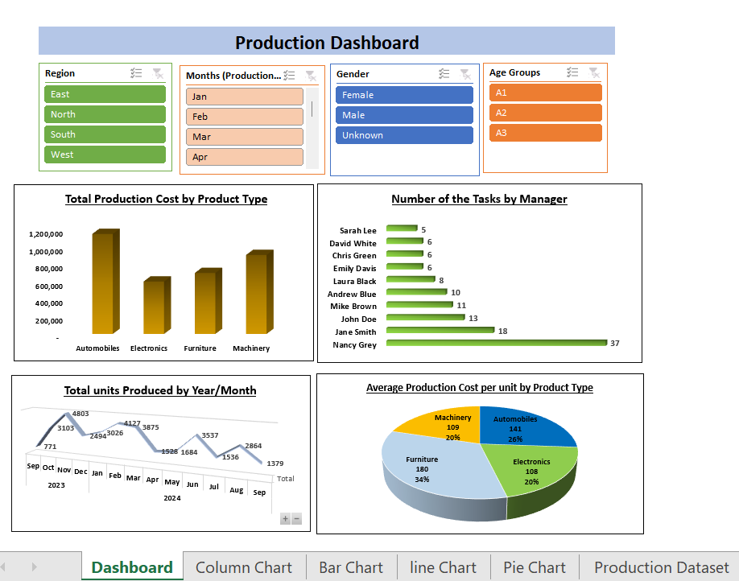

# Production Dashboard – Excel

An Excel-based production performance analysis project covering data preparation, feature engineering, and an interactive pivot dashboard built on 120 manufacturing records.

---

## Dashboard Preview



---

## Project Overview

This project analyzes one year of production data (September 2023 – September 2024) across 4 regions, 10 managers, and 4 product categories. The goal was to clean and enrich the raw dataset, then build an interactive dashboard to surface performance trends.

---

## Dataset

**File:** `Dataset_Production.xlsx`

| Column | Description |
|---|---|
| ProductionID | Unique ID for each production record |
| ProductionDate | Date of production |
| Region | North, South, East, West |
| Manager | 10 production managers |
| ProductType | Electronics, Automobiles, Machinery, Furniture |
| UnitsProduced | Number of units produced |
| TotalCost | Total production cost |
| Gender | Gender of the manager |
| True Age | Standardized manager age (fixed via VLOOKUP) |

---

## Data Preparation

The raw dataset had **inconsistent age entries** — the same manager appeared with different ages across records.

**Fix applied:**
- Data was sorted by Manager
- **VLOOKUP** was used to pull each manager's first consistent age, standardizing the `True Age` column across all records

---

## Feature Engineering

Two new columns were added to enrich the dataset:

**1. Age Groups**
Managers were segmented into 3 age brackets based on `True Age`:

| Group | Age Range |
|---|---|
| A1 | 25 – 28 |
| A2 | 36 – 42 |
| A3 | 49 – 57 |

**2. Product Cost Per Unit**
```
Product Cost Per Unit = TotalCost / UnitsProduced
```
This derived metric enables cost efficiency comparison across product types and managers.

---

## Dashboard

**File:** `Production_Dashboard.xlsx`

The dashboard includes **4 interactive slicers** — Region, Month, Gender, Age Group — and **4 pivot charts**:

| Chart | Insight |
|---|---|
| Column Chart | Total Production Cost by Product Type |
| Bar Chart | Number of Tasks handled by each Manager |
| Line Chart | Total Units Produced by Year and Month |
| Pie Chart | Average Production Cost Per Unit by Product Type |

---

## Key Findings

- **Automobiles** had the highest total production cost at **$1,152,805**
- **Nancy Grey** handled the most tasks with **37 out of 120** records
- Production peaked in **November 2023** with **4,803 units**
- **Furniture** had the highest average cost per unit at **$180**, while Electronics was the most cost-efficient at **$108**

---

## Files

| File | Description |
|---|---|
| `Dataset_Production.xlsx` | Raw dataset |
| `Production_Dashboard.xlsx` | Interactive pivot dashboard |

---

## Tools Used

- Microsoft Excel
- VLOOKUP
- Pivot Tables & Pivot Charts
- Slicers


